# ProyectoAvanzada
Sistema de control y préstamo de leyes y reglamentos de la república - SisLey

### Carlos Andrés Cuéllar Velásquez 2491117
### Walter Alexander Osoy Veliz 1126017

# -------------------Bitacora-------------------

### 1. Log in / Sign up.

   1.1 Se inicializa el formulario. 
   
    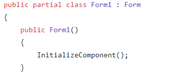
    
   1.2 Se inicializa el boton de Log in, en donde se capturan los datos por medio de un boolean.
   
    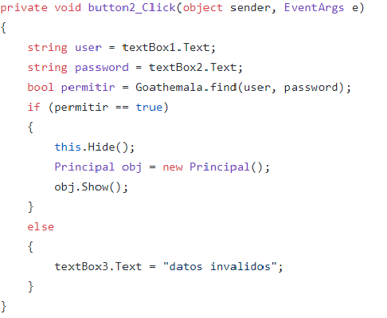 
   
   1.3 Se crea el boton de Sign up para registrarse.
   
     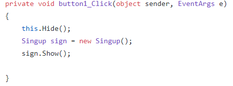
   

### 2. Class Goathemala.

   2.1 Se cran los atributos de la clase. 
   
    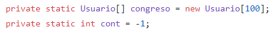
   
   2.2 Se crea la funcion para agregar un nuevo usuario.
   
    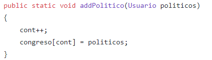
   
   2.3 Se crea la funcion para iniciar sesion si ya se tiene usuario. 
   
    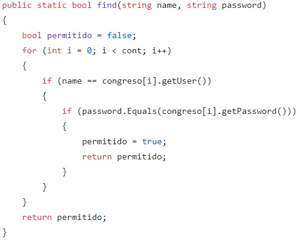
   
## 3. Class Principal.

   3.1 Se crea el boton de salida, para salir del programa.
   
    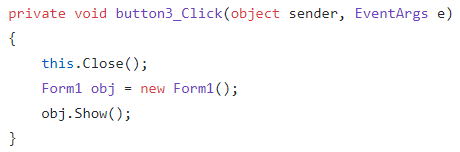
   
## 4. Class Principal.
   
   4.1 Boton de salida del sign up.
   
    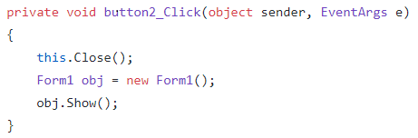
   
   4.2  Se creal el boton de aceptar para el registro del nuevo usuario, si falta informacion sale una alerta de llenar todos los datos y si todo se encuentra bien manda a llamar al arreglo para almacenar el nuevo usuario.
   
    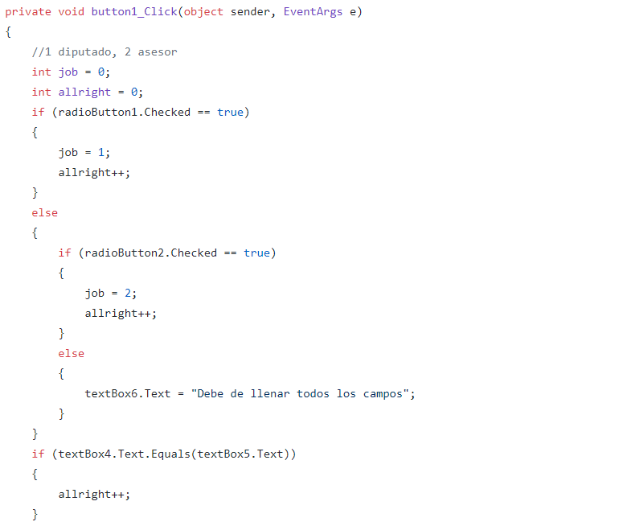
    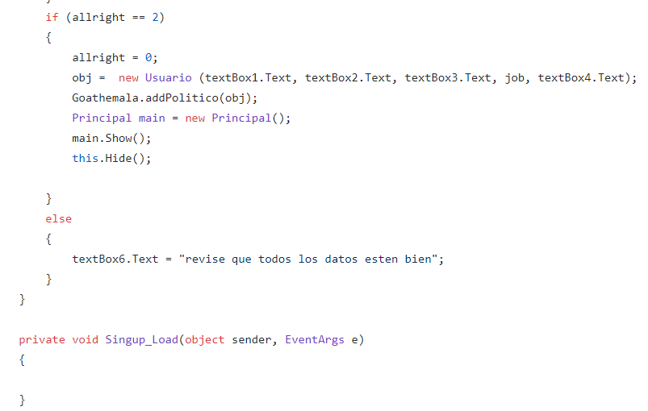
    
## 5. Class Sign Up.

   5.1 se crea el boton de salir del Sign Up. 
   
    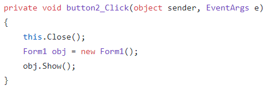

   
   5.2 Se creal el boton de aceptar para el registro del nuevo usuario, si falta informacion sale una alerta de llenar todos los datos y si todo se encuentra bien manda a llamar al arreglo para almacenar el nuevo usuario.
   
    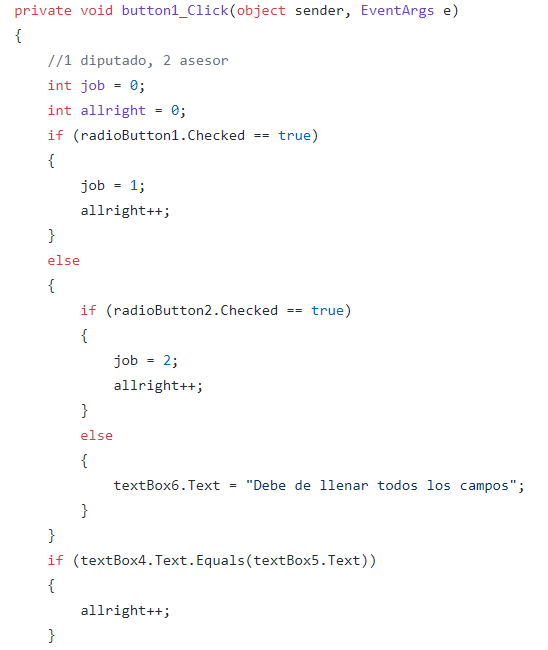
    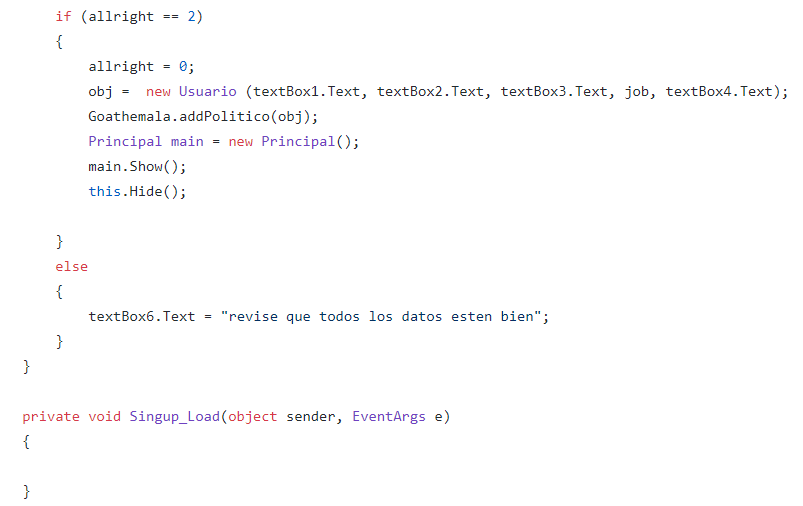

## 6. Class Usuario.

   6.1 Se crean los atributos de la clase usuario. 
   
    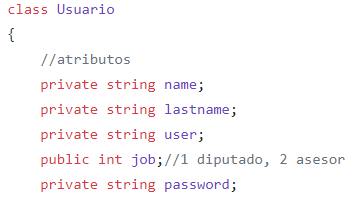

   6.2 Se crea el constructor de la clase Usuario.
   
    
    
   6.3 Se escriben los get y set de los atributos de class. 
   
    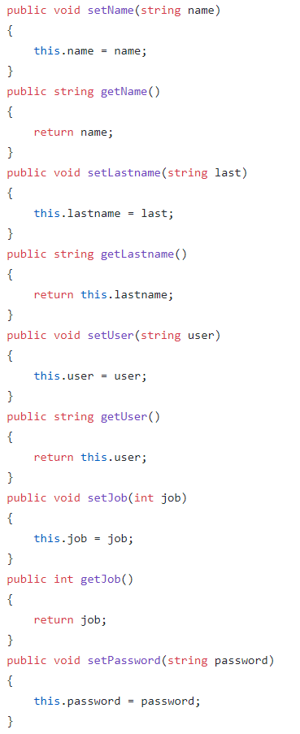

 
 

